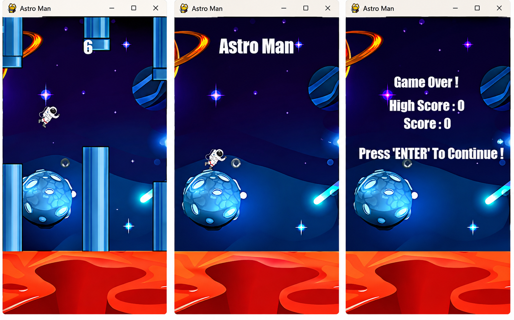

# 🚀 Astro Man

Astro Man is a 2D *Flappy Bird*-style game built with **Python** and **Pygame**. You control an astronaut who has to jump through pipe obstacles while flying through space. The longer you survive, the higher your score!

## 🎮 Screenshots

<p align="center">   </p>

## 📝 Short Review

Astro Man has a simple but addictive gameplay loop — just press **Space** or **Arrow Up** to make the astronaut jump and dodge the pipes. The space-themed visuals with planets, stars, and meteors give it more personality than a classic Flappy Bird clone. It's a solid project for practicing collision detection, sprite animation, and game state management in Pygame (welcome screen → main game → game over).

## 🕹️ How to Play

- Press **SPACE** or **↑ (Arrow Up)** to jump
- Avoid colliding with pipes and the ground
- Score increases each time you successfully pass a pipe
- Press **ESC** anytime to quit the game

## 🛠️ Tech Stack

- Python 3
- Pygame

## 📦 Installation & Running

```bash
pip install pygame
python astroman.py
```

## 📁 Folder Structure

```
Astro-Man/
├── astroman.py
├── gallery/
│   ├── sprites/
│   │   ├── astro.png
│   │   ├── bg.jpg
│   │   ├── base.jpg
│   │   └── pipe.png
│   └── audio/
│       ├── hit.wav
│       ├── point.wav
│       └── jump.wav
└── screenshots/
    ├── welcome-screen.png
    ├── gameplay.png
    └── game-over.png
```
